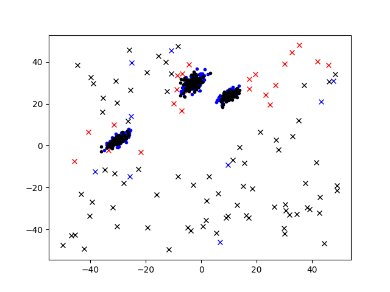
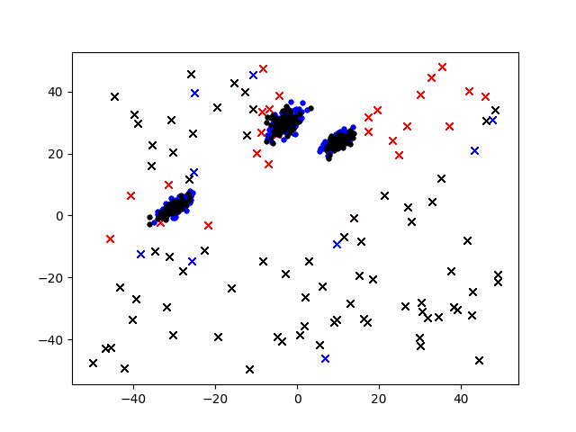
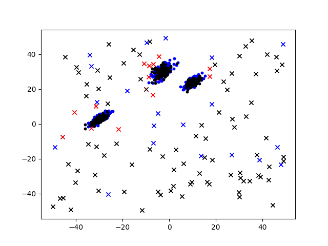
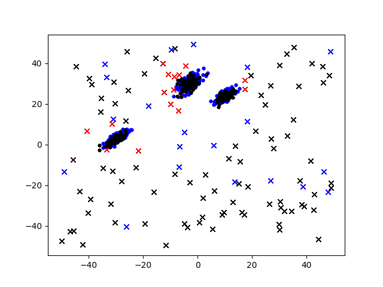

# Summary of various model sizes train against various data sizes

## Models train against 3 inliers with 100 point from each distribution and 10 outliers
**128|64|16, Latent of 8, 500 epochs against 100 from each distribution and 10 outliers**

- First numbers separated by `|` are encoder layer sizes. All models have decoder sizes the reverse of the encoder size.

All models start with a `Dense` layer equal to the input size (2) followed by the `Encoder` layers, two separate layers that take in the output of `Encoder` and output the mean and log variance of the distribution to sample from. The same amount of values as the latent layer is sampled which becomes the input to the `Decoder`. Then multiple layers take in the output of the `Decoder` which would result in the final output of the class prediction and the decoded initial variables. All layers have a `Relu` activation other than the final output layers (size 2 and size 1)which where the decoded variables have no activation whereas the predictor has a `sigmoid` activation.

Average accuracy: 0.9806451612903225
Average specificity: 0.4
Average loss: [0.04871949 0.02363075 0.02508874]
Average cm: 
||True 0|True 1|
|-|-|-|
|Predicted 0|60.0|1.2
|Predicted 1|0.0|0.8

- These are the average confusion matrices of each model from the cross validation (5-fold) where 0,1 corresponds to is outlier and is not outlier. Average loss describes `[Model lost, Decoding loss (MSE), Prediction loss (Binary cross entropy)]`

Test cm: 
||True 0|True 1|
|-|-|-|
|Predicted 0|300.0|24
|Predicted 1|0.0|76.

- This is the confusion matrix where the model is trained on the entire dataset (300 inliers 10 outliers) then tested on 100 points from each distribution

CV took 84.85478473500007 seconds
Fitting all data took 10.899657072000082 seconds

- And finally some timing data, everything is run on a RTX 2060 Super with a Ryzen 2600 on a single thread.

[01](#01)
All runs also include a plot.

**64|16, Latent of 8, 500 epochs against 100 from each distribution and 10 outliers**

Average accuracy: 0.9838709677419355
Average specificity: 0.5
Average loss: [0.02930938 0.0035894  0.02571998]
Average cm: 
||True 0| True 1|
|-|-|-|
|Predicted 0|60.0|1.0
|Predicted 1|0.0|1.0

Test cm:
||True 0| True 1|
|-|-|-|
|Predicted 0|300.|  24.
|Predicted 1|  0.|  76.
CV took 77.07271669800002 seconds
Fitting all data took 9.901283843999863 seconds
[02](#02)

**64|16, Latent of 4, 500 epochs against 100 from each distribution and 10 outliers**

Average accuracy: 0.9774193548387097
Average specificity: 0.3
Average loss: [0.04631924 0.01513968 0.03117957]
Average cm: 
||True 0| True 1|
|-|-|-|
|Predicted 0|60.0|1.4
|Predicted 1|0.0|0.6

Test cm: 
||True 0| True 1|
|-|-|-|
|Predicted 0|300. |29.|
|Predicted 1|  0. |71.|
CV took 76.51235693200033 seconds
Fitting all data took 9.882362216999809 seconds
[03](#03)

**64|32, Latent of 16 500 epochs against 100 from each distribution and 10 outliers**

Average accuracy: 0.9838709677419355
Average specificity: 0.5
Average loss: [0.04591437 0.01811937 0.027795  ]
Average cm: 
||True 0| True 1|
|-|-|-|
|Predicted 0|60.0|1.4
|Predicted 1|0.0|0.6

Test cm: 
||True 0| True 1|
|-|-|-|
|Predicted 0|300.|  26.
|Predicted 1|  0.|  74.

CV took 76.43729296300035 seconds
Fitting all data took 9.778400921999946 seconds
[04](#04)

**256|128|64, Latent of 16, 500 epochs against 100 from each distribution and 10 outliers**

Average accuracy: 0.9774193548387097
Average specificity: 0.3
Average loss: [0.06764619 0.04107553 0.02657066]
Average cm:
||True 0| True 1|
|-|-|-|
|Predicted 0| 60.   |1.4
|Predicted 1|  0.   |0.6
 
Test cm:
||True 0| True 1|
|-|-|-|
|Predicted 0|300.|  26.
|Predicted 1|  0.|  74.
CV took 85.59402215599994 seconds
Fitting all data took 11.365959077000298 seconds
[05](#05)

## Models train against 3 inliers with 200 point from each distribution and 20 outliers

**128|64|16, Latent of 8, 500 epochs against 200 from each distribution and 20 outliers**

Average accuracy: 0.9935483870967742
Average specificity: 0.8
Average loss: [0.02022781 0.00952484 0.01070296]
Average cm: 
||True 0| True 1|
|-|-|-|
|Predicted 0|120.    |0.8
|Predicted 1|  0.    |3.2

Test cm:
||True 0| True 1|
|-|-|-|
|Predicted 0|300.|  15.
|Predicted 1|  0.|  85.

CV took 161.1672995470003 seconds
Fitting all data took 20.709117001000322 seconds
[11](#11)

**64|16, Latent of 8, 500 epochs against 200 from each distribution and 20 outliers**

Average accuracy: 0.9903225806451613
Average specificity: 0.7
Average loss: [0.02624919 0.01451225 0.01173695]
Average cm: 
||True 0| True 1|
|-|-|-|
|Predicted 0|120.0|1.2
|Predicted 1|0.0|2.8

Test cm: 
||True 0| True 1|
|-|-|-|
|Predicted 0|300.|  15.
|Predicted 1|  0.|  85.
CV took 146.70546318200013 seconds
Fitting all data took 18.664482336999754 seconds
[12](#12)

**64|16, Latent of 4, 500 epochs against 200 from each distribution and 20 outliers**

Average accuracy: 0.9935483870967742
Average specificity: 0.8
Average loss: [0.02985603 0.02333329 0.00652274]
Average cm: 
||True 0| True 1|
|-|-|-|
|Predicted 0|120.0|0.8
|Predicted 1|0.0|3.2

Test cm: 
||True 0| True 1|
|-|-|-|
|Predicted 0|300.|  13.
|Predicted 1|  0.|  87.
CV took 149.26085723699953 seconds
Fitting all data took 18.925075711999853 seconds
[13](#13)

**64|32, Latent of 16 500 epochs against 200 from each distribution and 20 outliers**

Average accuracy: 0.9951612903225807
Average specificity: 0.85
Average loss: [0.05269697 0.03519554 0.01750144]
Average cm: 
||True 0| True 1|
|-|-|-|
|Predicted 0|120.0|0.6
|Predicted 1|0.0|3.4

Test cm: 
||True 0| True 1|
|-|-|-|
|Predicted 0|300.|  16.
|Predicted 1|  0.|  84.
CV took 146.13585800700002 seconds
Fitting all data took 18.59559304100003 seconds
[14](#14)

**256|128|64, Latent of 16, 500 epochs against 200 from each distribution and 20 outliers**

Average accuracy: 0.9887096774193548
Average specificity: 0.75
Average loss: [0.21340177 0.19816272 0.01523904]
Average cm: 
||True 0| True 1|
|-|-|-|
|Predicted 0|119.6|1.0
|Predicted 1|0.4|3.0

Test cm: 
||True 0| True 1|
|-|-|-|
|Predicted 0|300.|  17.
|Predicted 1|  0.|  83.
CV took 161.17669851499977 seconds
Fitting all data took 21.19138960700002 seconds
[15](#15)

# Overall performance
|Name|Dataset size|Model|CV Acc|CV Spec|CV Loss|Time to fit all data (seconds)|
|-|-|-|-|-|-|-|
|01|Small|256\|128\|64, Latent of 8|0.9806451612903225|0.4|[0.04871949 0.02363075 0.02508874]|10.899657072000082
|02|Small|64\|16, Latent of 8|**0.983870967741935**5|**0.5**|[0.02930938 0.0035894  0.02571998]|9.901283843999863
|03|Small|64\|16, Latent of 4|0.9774193548387097|0.3|[0.04631924 0.01513968 0.03117957]|9.882362216999809
|04|Small|64\|32, Latent of 16|**0.9838709677419355**|**0.5**|[0.04591437 0.01811937 0.027795  ]|9.778400921999946 
|05|Small|256\|128\|64, Latent of 16|0.9774193548387097|0.3|[0.06764619 0.04107553 0.02657066]|11.365959077000298
|11|Big|256\|128\|64, Latent of 8|0.9935483870967742|0.8|[0.02022781 0.00952484 0.01070296]|20.709117001000322
|12|Big|64\|16, Latent of 8|0.9903225806451613|0.7|[0.02624919 0.01451225 0.01173695]|18.664482336999754
|13|Big|64\|16, Latent of 4|0.9935483870967742|0.8|[0.02985603 0.02333329 0.00652274]|18.925075711999853
|14|Big|64\|32, Latent of 16|**0.9951612903225807**|**0.85**|[0.05269697 0.03519554 0.01750144]|18.59559304100003
|15|Big|256\|128\|64, Latent of 16|0.9887096774193548|0.75|[0.21340177 0.19816272 0.01523904]|21.19138960700002

Model `13` performed best on unseen data among models with big datasets but model `01` and `02` performed best among small datasets. (Not shown in table)

# Plots
01

02

03

04

05

11

12

13

14

15
