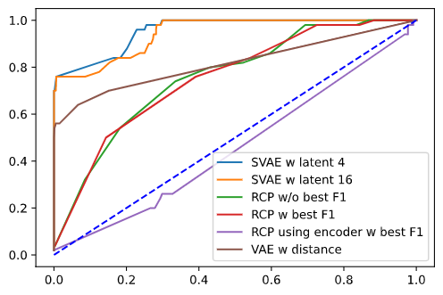

### Supervised VAE (SVAE) with latent 4
Binary supervised classifier
**CV results**
Average accuracy: 0.9784615384615385
Balanced acc: 0.8783333333333334
Average specificity: 0.9966666666666667
Average sensitivity (Detection rate): 0.76
Average loss: [3.45949533]
Average False Alarm: 0.24000000000000002
Average F1: 0.8444444444444444
Average cm:
||True 0| True 1|
|-|-|-|
|Predicted 0|11.959999999999999|0.24
|Predicted 1|0.04|0.7599999999999999
**Test result on unseen data:**
Average accuracy: 0.6498
Balanced acc: 0.6497999999999999
Average specificity: 0.9643999999999999
Average sensitivity (Detection rate): 0.3352
Average loss: nan
Average False Alarm: 0.6648
Average F1: 0.48905748468047855
Average cm:
||True 0| True 1|
|-|-|-|
|Predicted 0|96.43999999999998|66.47999999999999
|Predicted 1|3.5599999999999996|33.519999999999996

### Supervised VAE (SVAE) with latent 16
Binary supervised classifier
**CV results**
Average accuracy: 0.9753846153846154
Balanced acc: 0.8766666666666667
Average specificity: 0.9933333333333333
Average sensitivity (Detection rate): 0.76
Average loss: [3.28985469]
Average False Alarm: 0.24000000000000005
Average F1: 0.8260869565217391
Average cm:
||True 0| True 1|
|-|-|-|
|Predicted 0|11.919999999999998|0.24000000000000005
|Predicted 1|0.08|0.76
**Test result on unseen data:**
Average accuracy: 0.6533
Balanced acc: 0.6533
Average specificity: 0.9642000000000001
Average sensitivity (Detection rate): 0.3424
Average loss: nan
Average False Alarm: 0.6576
Average F1: 0.49687998839065445
Average cm:
||True 0| True 1|
|-|-|-|
|Predicted 0|96.42|65.75999999999999
|Predicted 1|3.5800000000000005|34.239999999999995

### VAE with reconstruction probability (rcp)
http://dm.snu.ac.kr/static/docs/TR/SNUDM-TR-2015-03.pdf
**CV results**
Average accuracy: 0.8476923076923077
Balanced acc: 0.6333333333333334
Average specificity: 0.8866666666666667
Average sensitivity (Detection rate): 0.38000000000000006
Average loss: [0.36137612]
Average False Alarm: 0.62
Average F1: 0.2773722627737227
Average cm:
||True 0| True 1|
|-|-|-|
|Predicted 0|10.64|0.6199999999999999
|Predicted 1|1.3599999999999999|0.38
**Test result on unseen data:**
Average accuracy: 0.5299999999999999
Balanced acc: 0.53
Average specificity: 0.85
Average sensitivity (Detection rate): 0.21
Average loss: nan
Average False Alarm: 0.79
Average F1: 0.3088235294117647
Average cm:
||True 0| True 1|
|-|-|-|
|Predicted 0|84.99999999999999|79.0
|Predicted 1|14.999999999999996|21.0

### VAE with reconstruction probability (rcp) test using conf for best F1
Calculate the best value that separates class 0 and class 1 that gives best F1 and use that value in testing
**CV results**
Average accuracy: 0.8476923076923076
Balanced acc: 0.6241666666666666
Average specificity: 0.8883333333333333
Average sensitivity (Detection rate): 0.36000000000000004
Average loss: [0.37183713]
Average False Alarm: 0.64
Average F1: 0.26666666666666666
Average cm:
||True 0| True 1|
|-|-|-|
|Predicted 0|10.66|0.6399999999999999
|Predicted 1|1.34|0.36
**Test result on unseen data:**
Average accuracy: 0.612
Balanced acc: 0.612
Average specificity: 0.3226
Average sensitivity (Detection rate): 0.9014
Average loss: nan
Average False Alarm: 0.09859999999999998
Average F1: 0.6990848456646502
Average cm:
||True 0| True 1|
|-|-|-|
|Predicted 0|32.260000000000005|9.86
|Predicted 1|67.74000000000001|90.14000000000001

### VAE with rcp using encoder
Reconstruct the point, then pass the point through the encoder to calculate reconstruction probability
**CV results**
Average accuracy: 0.6461538461538461
Balanced acc: 0.4691666666666666
Average specificity: 0.6783333333333332
Average sensitivity (Detection rate): 0.26
Average loss: [0.73917013]
Average False Alarm: 0.74
Average F1: 0.1015625
Average cm:
||True 0| True 1|
|-|-|-|
|Predicted 0|8.139999999999999|0.74
|Predicted 1|3.8600000000000003|0.26
**Test result on unseen data:**
Average accuracy: 0.4949
Balanced acc: 0.4949
Average specificity: 0.6628000000000001
Average sensitivity (Detection rate): 0.327
Average loss: nan
Average False Alarm: 0.6729999999999999
Average F1: 0.3929816127869247
Average cm:
||True 0| True 1|
|-|-|-|
|Predicted 0|66.28|67.3
|Predicted 1|33.72|32.7

### VAE using distance
Detecting anomalies using distance, prediction used the distance that gave best F1
**CV results**
Average accuracy: 0.8153846153846154
Balanced acc: 0.7625
Average specificity: 0.8250000000000001
Average sensitivity (Detection rate): 0.7
Average loss: [0.7391067]
Average False Alarm: 0.3
Average F1: 0.3684210526315789
Average cm:
||True 0| True 1|
|-|-|-|
|Predicted 0|9.9|0.3
|Predicted 1|2.1|0.7
**Test result on unseen data:**
Average accuracy: 0.8245
Balanced acc: 0.8245
Average specificity: 0.8408
Average sensitivity (Detection rate): 0.8082
Average loss: nan
Average False Alarm: 0.1918
Average F1: 0.8215919487648674
Average cm:
||True 0| True 1|
|-|-|-|
|Predicted 0|84.08000000000001|19.18
|Predicted 1|15.920000000000002|80.82000000000001

### Crossvalidation results

### Post crossvalidation (100 inliers and 100 outliers)
