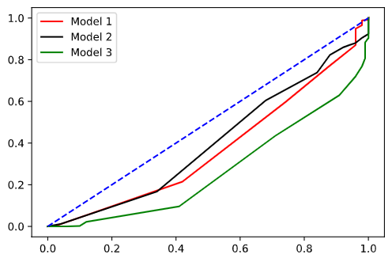

**120 inliers, 12 outliers trained on one VAE**

Test result on unseen data:
Average accuracy: 0.523
Balanced acc: 0.523
Average specificity: 0.8088
Average sensitivity (Detection rate): 0.2372
Average loss: nan
Average False Alarm: 0.7628
Average F1: [0.38344649 2.48117155]
Average cm:
||True 0| True 1|
|-|-|-|
|Predicted 0|80.88000000000001|76.28
|Predicted 1|19.12|23.72

**120 inliers, 12 outliers split into half to train 2 different models, then average confidence of both models taken**

Test result on unseen data:
Average accuracy: 0.5019
Balanced acc: 0.5019
Average specificity: 0.7942
Average sensitivity (Detection rate): 0.2096
Average loss: nan
Average False Alarm: 0.7903999999999999
Average F1: [0.34656085 2.03692906]
Average cm:
||True 0| True 1|
|-|-|-|
|Predicted 0|79.41999999999999|79.03999999999999
|Predicted 1|20.580000000000002|20.96

**240 inliers, 24 outliers then split into half to train 2 different models, then average confidence of both models taken** (Essentially two models trained on different datasets with same distribution, and average of both models taken for testing)

Test result on unseen data:
Average accuracy: 0.5341
Balanced acc: 0.5341
Average specificity: 0.8695999999999999
Average sensitivity (Detection rate): 0.1986
Average loss: nan
Average False Alarm: 0.8014
Average F1: [0.33138662 3.04601227]
Average cm:
||True 0| True 1|
|-|-|-|
|Predicted 0|86.96|80.14
|Predicted 1|13.040000000000003|19.86

